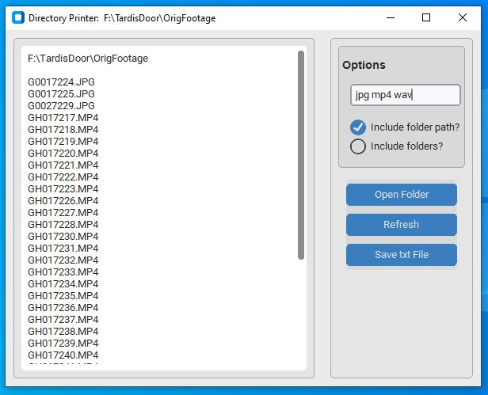

# Directory-Printer
*Easily list files in a folder*

## Overview
This is a simple directory printer that makes it easy to list files within a folder so you can copy/paste into an email or document.  You can also save the list as a text file.  Included are a few options such as listing only specific filetypes, include the folder path, and whether or not to include folders in your list.  

## How To Use

**Open Folder** - This will allow you to browse to the folder you want to generate a list of files from.  Once you select a folder, it will list all the files within that directory.  It will also update the title bar with the folder's path.

**Refresh** - This will update the file list.  This is useful if you change any options, or add additional files to your folder.

**Save txt File** - This will save your file list to a txt file.  When you click, it will ask you where to save your file.  Give it a name and click Save.

#### Options

**All File Types** - You can specify which files you are interested in by listing the extension.  You can list multiple file extensions by separating them with a comma or a space.  Click the Refresh button to update your list that includes only the files you are interested in.  To remove the filter, simply delete the extensions from this section.

**Include folder path** - This will include the folder path at the top of the document.  This is nice for reference in case you need to go back.

**Include folders** - In addition to the files, this option will also include the folder names in this directory.  Folders are specified with a square bracket around the name (ie [Folder Name]).  Click the Refresh button to update your list.

## Libraries Used
- [Tkinter](https://docs.python.org/3/library/tkinter.html)
- [CustomTkinter](https://customtkinter.tomschimansky.com/)
- [os](https://docs.python.org/3/library/os.html) (Operating System Interfaces)
- [re](https://docs.python.org/3/library/re.html) (Regular Expressions)

